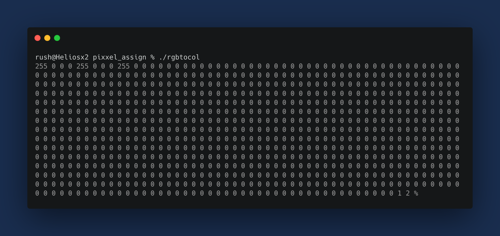

## Convert RGB Format to COLOR256 Format 

### Working 

- Takes image and dimensions as input in RGB format.
- Populate a palette based on each pixel in the image.
- Checks performed for checking if color of pixel is already present in the palette.
- If not, add color to palette and increase palette size.
- Initialise output and append palette and color indexes.
- Color indexes are grabbed from the palette. 
- Remaining values in the output are filled with 0 and returned. 

### Sample Output 1 : Input = RGB/BGR/GRB (3x3) {255, 0, 0, 0, 255, 0, 0, 0, 255, 0, 0, 255, 0, 255, 0, 255, 0, 0, 0, 255, 0, 255, 0, 0, 0, 0, 255}

.png)
                            

### Sample Output 2 : Input = RGB (1x3) {255, 0, 0, 0, 255, 0, 0, 0, 255}

